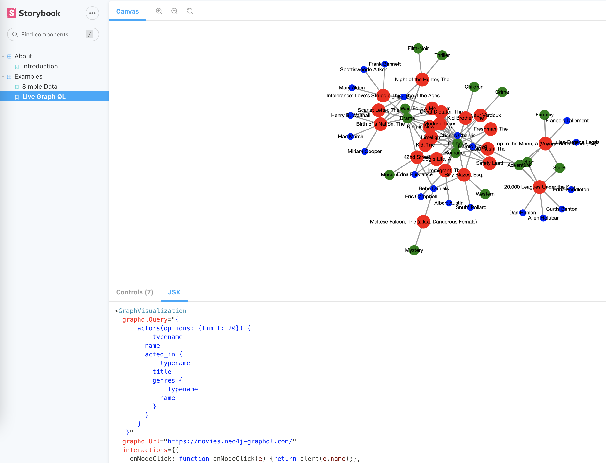

# react-graph-viz-engine
An out-of-the-box React component for visualizing graph data.

Key features:
- An easily embeddable React component to render force-directed graphs.
- Integrated translation into library specific formats from a unified standard (GraphQL).
- A straightforward way to add (rule-based) styling and interactions to your visualizations.
- Support for multiple renderers & graph layouts.

React component for visualizing graph data.

## Getting Started
**TLDR - Try the [Online Demo](https://react-graph-viz-engine.s3.us-west-1.amazonaws.com/index.html)!**

This project wraps the library in a Storybook UI. [More information on Storybook here](https://storybook.js.org/).

The Storybook provides examples for each of the functionalities this library provides. For each of these examples, you can:
* Change the config parameters in the "Controls" tab and see how they affect the visualization ;
* Get the corresponding JSX definition of the React component



## Run the storybook locally
To run the storybook on a local machine, clone the repo. Then:

```
yarn install
yarn start
```

A web browser will open with the storybook definitions for the component.

## Using the component in your own apps
To use this component in your own React app, first install the library:
```
npm install react-graph-viz-engine
```
- or -
```
yarn add react-graph-viz-engine
```

Then, you can include the component anywhere inside your app:

```
import GraphVisualization from 'react-graph-viz-engine'
import React from "react";

export const App = () => {
return <GraphVisualization
        data={...}
        graphqlUrl={...}
        graphqlQuery={...}
        renderer="cytoscape"
        layout="graph"
        showNavigator={false}
        style = {},
        interactions = {} />
}
```

The [Storybook](https://react-graph-viz-engine.s3.us-west-1.amazonaws.com/index.html) contains examples on what to use in the fields of the GraphVisualization component. 


## Extending the library
This library can be extended with your own graph renderers and customizations.
See `src/component/renderer/cytoscape` and `src/component/renderer/react-force-graph` for examples.

After cloning this repository, install and run the storybook:
```
yarn install
yarn start
# yarn build
```

Each component (`src/component/renderer/`) should contain the following five files:
```
renderer.tsx:       The react component that renders the visualization.
formatter.ts:       Code responsible for translating the generic data object into a visualization-specific data format.
config.ts:          A place for generic config variables for the visualization.
config-mapper.ts:   Code responsible for translating the generic configuration object into visualization-specific style config.
style.css:          CSS styling to apply to the React component.
```

Don't forget to extend `src/component/graph/Graph.tsx` to include your custom component. 

## Feature Requests / Issues
This is an experimental release of the library. If you have any questions, please reach out to the maintainers of this project.
Feedback is much appreciated.